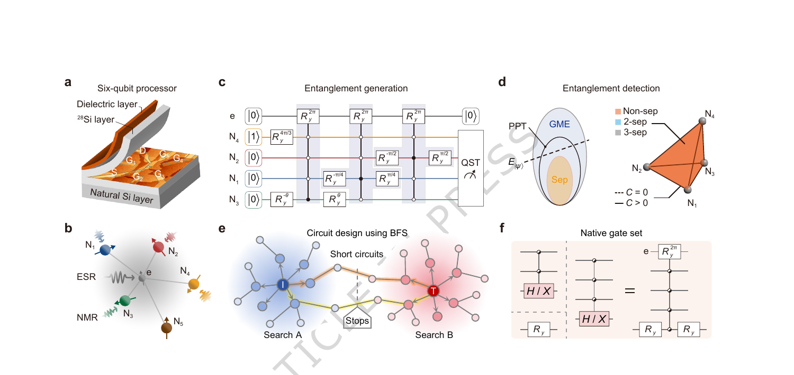
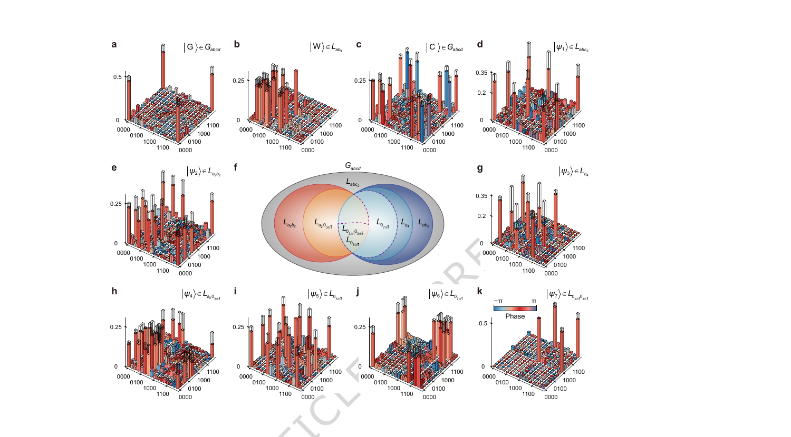
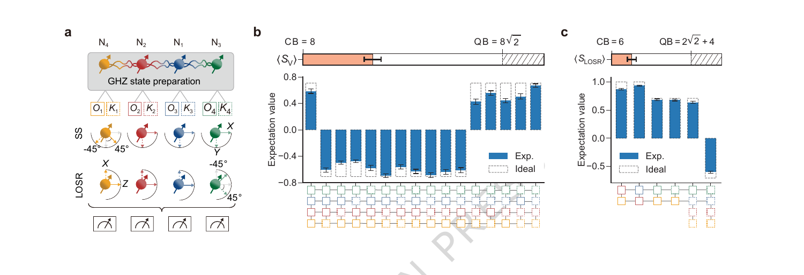
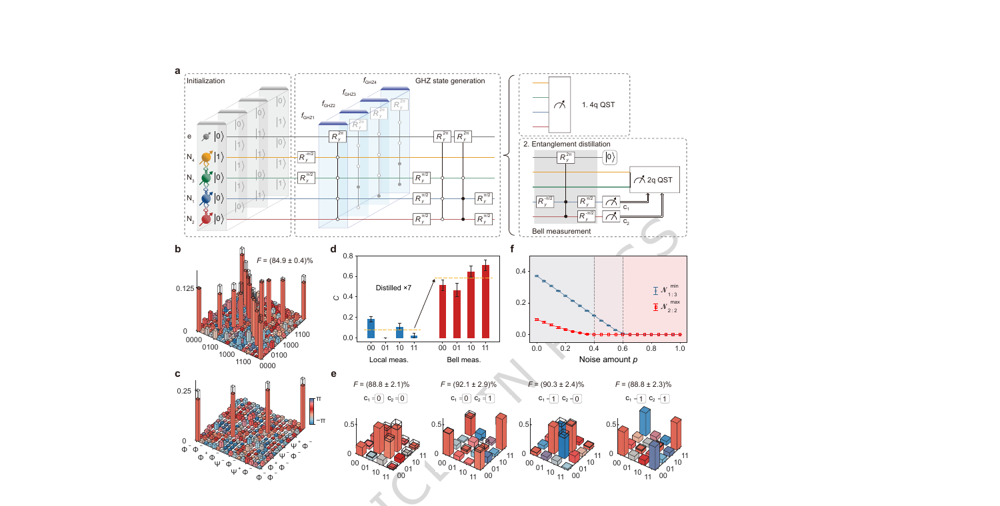

## Publication

Nature Communications, 2026. The study was accepted on 4 June 2026 and is available through the DOI link above.

## Research Question

Can a silicon spin-qubit processor move beyond isolated GHZ demonstrations and systematically generate, reconstruct, and verify the full diversity of four-qubit entanglement?

## Platform and Method

The experiment uses a donor-based silicon quantum processor containing five phosphorus nuclear spins coupled through a shared electron spin. Four nuclear spins encode the target system, while native electron-mediated multi-qubit gates provide all-to-all connectivity.

We designed hardware-efficient preparation circuits with a bidirectional breadth-first search compiler, refined their parameters variationally, and reconstructed the prepared states with overlapping tomography and tensor-network learning.

*Figure 1 - Silicon donor nuclear-spin processor, hardware-efficient entanglement circuit, bidirectional BFS compiler, and native gate set.*

## Nine Entanglement Families

Representative states from all nine canonical four-qubit entanglement families were prepared and reconstructed. The GHZ, W, and cluster states reached fidelities of 84.2%, 83.8%, and 81.1%, respectively. Entanglement witnesses, partial-transpose negativity, and qubit-loss tests were then used to resolve genuine multipartite entanglement and robustness.

*Figure 2 - Reconstructed density matrices for representative states spanning all nine four-qubit entanglement families.*

## Key Results

- Genuine four-qubit entanglement was verified across the prepared state families, together with their different responses to losing one or two qubits.
- The GHZ state violated the Seevinck-Svetlichny bound by more than eight standard deviations, reaching 9.16 ± 0.14 against the classical bound of 8.
- A second LOSR-based inequality reached 6.21 ± 0.05, exceeding its classical bound of 6 by more than four standard deviations.
- A noisy Smolin state entered a bound-entangled regime for noise probability 0.40-0.60.
- Joint Bell-state measurement increased the residual pair concurrence from 0.08 to an average of 0.58, realizing seven-fold entanglement distillation.

*Figure 3 - Experimental tests of the Seevinck-Svetlichny and LOSR-based multiparticle Bell-type inequalities.*

*Figure 4 - Preparation, tomography, noise-driven bound-entanglement region, and entanglement unlocking of the Smolin state.*

## My Contributions

- Designed hardware-efficient quantum circuits for the native multi-qubit gate set of a silicon donor nuclear-spin platform.
- Used a bidirectional BFS compilation algorithm to optimize gate sequences and circuit depth.
- Combined compilation with a partitioning strategy to provide a feasible route for scaling multipartite entanglement resources to tens of qubits.

## Significance

The work expands silicon spin systems from a narrow set of entanglement demonstrations to a programmable collection of multipartite resources, providing a foundation for quantum simulation, metrology, networking, and larger silicon-based quantum processors.
