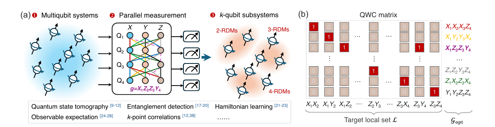
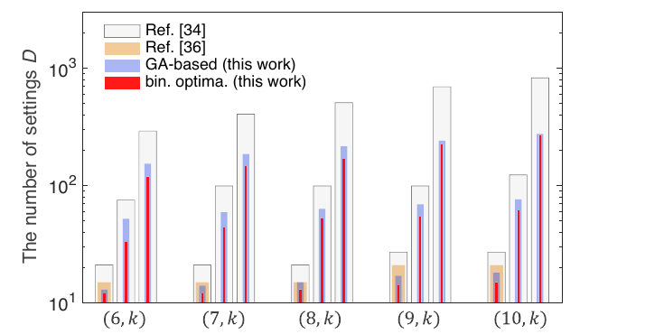
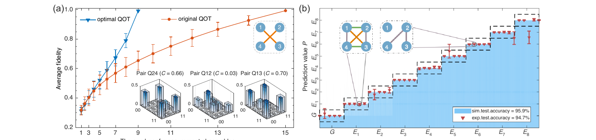
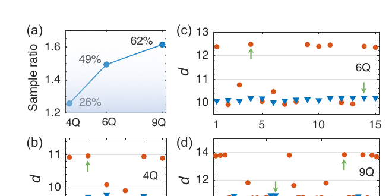

## Publication

Physical Review Applied 24, 044091 (2025), selected as an Editors' Suggestion. Published on 29 October 2025.

## Research Question

How can all target reduced density matrices be reconstructed with the fewest experimentally feasible parallel measurement settings, while retaining flexibility across system sizes and interaction topologies?

## Optimal QOT Framework

We map quantum overlapping tomography to a minimum clique-cover problem. A binary linear program finds optimal measurement schedules, while a fast greedy iterative algorithm provides near-optimal solutions for larger systems. The same framework also supports nearest-neighbor and mixed-locality reduced density matrices.

*Figure 1 - Parallel Pauli measurements recover overlapping reduced density matrices; the qubit-wise commuting matrix turns schedule design into a coverage optimization problem.*

*Figure 2 - Comparison with earlier QOT constructions for six to ten qubits and locality lengths from two to four.*

## Experimental Validation

The method was tested on two complementary platforms. Four-qubit nuclear magnetic resonance experiments reconstructed two-qubit reduced density matrices and classified nine entanglement families. Noisy superconducting processors prepared four-, six-, and nine-qubit GHZ states to evaluate measurement-sample efficiency at increasing scale.

## Key Results

- Optimal QOT reduced the four-qubit measurement schedule from 15 observables to 9 and cut experimental time by approximately 40% relative to the original protocol.
- Reconstructed two-qubit reduced density matrices achieved average fidelities of approximately 99.1% for both the original and optimized schedules.
- A deep neural network classified nine four-qubit entanglement families with 95.9% accuracy in simulation and 94.7% accuracy on experimental data, without full state tomography.
- For four-, six-, and nine-qubit GHZ experiments, the original QOT required 26%, 49%, and 62% more samples, respectively, to reach comparable reconstruction quality.

*Figure 3 - Reconstruction fidelity versus measurement count and neural-network classification across nine four-qubit entanglement families.*

*Figure 4 - Sample-cost comparison for four-, six-, and nine-qubit GHZ-state experiments.*

## My Contributions

- Combined optimal overlapping tomography with a deep neural network to learn nine classes of four-qubit entanglement from partial measurement data.
- Enabled entanglement-family recognition without full quantum state tomography.
- Achieved 95.9% classification accuracy on numerical simulations and 94.7% on real experimental data.

## Significance

The framework makes partial tomography more efficient, scalable, and adaptable to realistic quantum-hardware constraints. It supports state characterization, local-observable estimation, Hamiltonian learning, and machine-learning-assisted analysis across multiple processor technologies.
